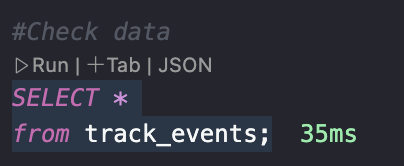

# Website Traffic Analytics 
This data project has been used as a take-home assignment in the recruitment process for the data science positions at Linkfire. The dataset is available on stratascratch link : https://platform.stratascratch.com/data-projects/website-traffic-analysis

The goal of this project is to understand this traffic better, in particular and distribution of events, and to develop ideas how to increase the links' clickrates. In this case we will be using SQL to provide answer to the presented questions:

1. How many total pageview events did the links in the provided dataset receive in the full period, and how many per day?
2. What about the other recorded events?
3. WHich countries did the pageviews come from?
4. What was the overall click rate (clicks/pageviews)?

The data set provided (traffic.csv) contains web traffic data ("events") from a few different pages ("links") over a period of 7 days including various categorical dimensions about the geographic origin of that traffic as well as a page's content: isrc.

